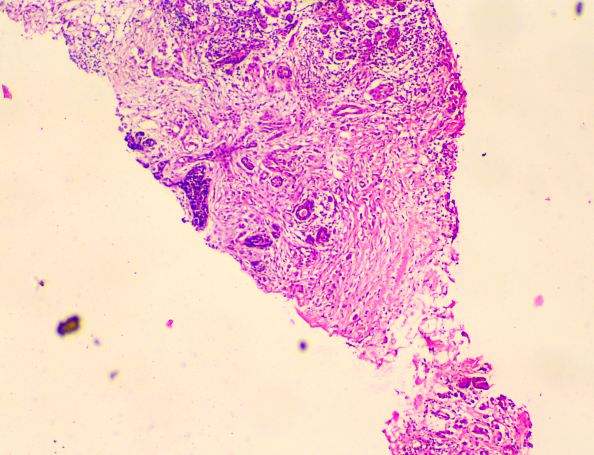
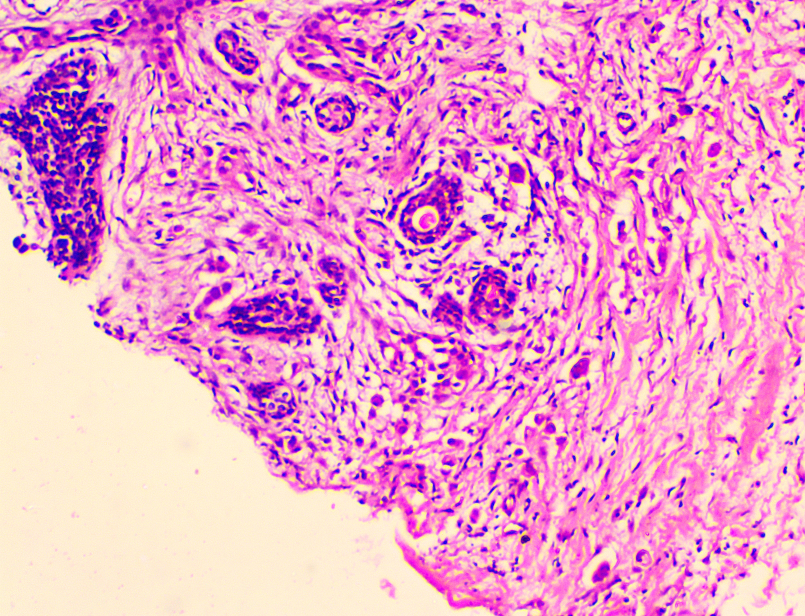
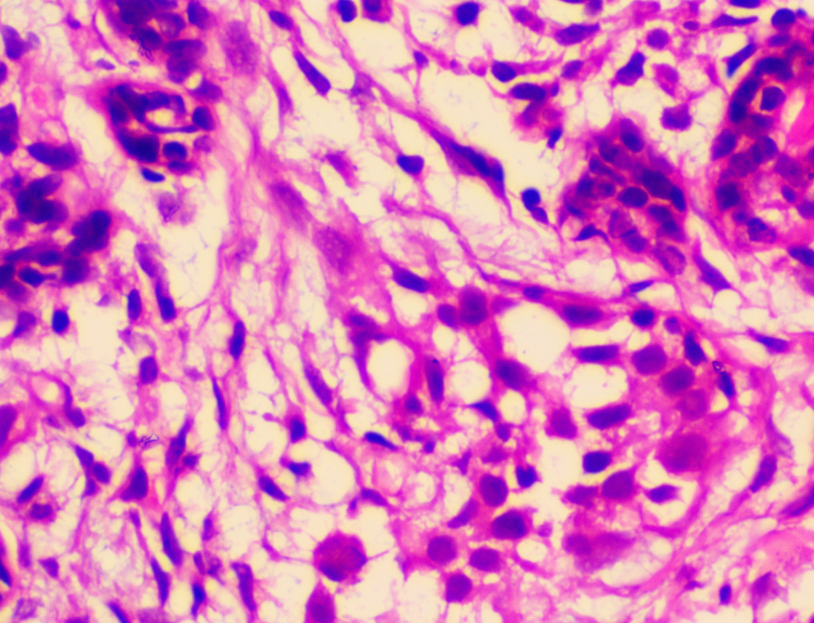

# **🔬 Histopathological Image Super-Resolution: SR3 Diffusion Model with Interactive GUI 🖼️**

This repository presents a comprehensive solution for achieving super-resolution on histopathological tissue images using a PyTorch-based SR3 (Super-Resolution via Repeated Refinement) diffusion model. The project includes functionalities for image patching, blending, model inference, and an interactive Graphical User Interface (GUI) for visualizing and interacting with the super-resolved outputs.

## **📝 Table of Contents**

* [Project Overview](#bookmark=id.d940rh878mfe)  
* [Features](#bookmark=id.nwetq0ee63m1)  
* [Model Architecture](#bookmark=id.8bok0vov191)  
* [Training](#bookmark=id.kpbdbo50hjuq)  
* [Installation](#bookmark=id.sj55p6mplpjp)  
* [Usage](#bookmark=id.affv8pt8o4q9)  
* [Files in this Repository](#bookmark=id.bs154y5pqmxq)  
* [Results & Visuals](#bookmark=id.jqwbqzbyyhfv)  
* [Contributing](#bookmark=id.s0urjpxdwo5q)  
* [License](#bookmark=id.p6cy18qulykk)  
* [Contact](#bookmark=id.hhxd7gfw3hch)

## **🚀 Project Overview**
40X sample( lens microscope)

100X Zoomed (SR3 model Output)

400X Zoomed (SR3 model output)

These are few sample images of Ductal Carcinoma and their corresponding model output tissue samples.

    The primary objective of this project is to enhance the resolution of low-resolution histopathological images sampled from an ordinary lens microscope, to generate an electron microscope equivalent zoomed high resolution sample, saving cost, man power and boosting efficiency. By employing our own SR3 diffusion model, the system aims to reconstruct high-resolution images from their lower-resolution counterparts, preserving intricate tissue details.

Beyond the core super-resolution model, this project also integrates a **Graphical User Interface (GUI) application** built with tkinter. This GUI allows users to:

* Load histopathological images.  
* Select regions of interest using a bounding box.  
* Apply super-resolution at different zoom factors  to the selected regions, displaying the enhanced output in a new window.

The project structure supports:

* Robust image preprocessing, including dividing images into overlapping patches and blending them back together for seamless reconstruction.  
* A custom SR3 diffusion model for denoising diffusion probabilistic modeling to generate high-resolution images.  
* A structured training pipeline for the diffusion model.  
* Inference scripts for applying the trained model to new images and performing patch-based super-resolution.

## **✨ Features**

* **SR3 Diffusion Model:** Implements the Super-Resolution via Repeated Refinement (SR3) model, a type of Denoising Diffusion Probabilistic Model (DDPM), for high-quality image super-resolution.  
* **Patch-Based Processing:** Includes functionalities to divide large images into smaller patches and then seamlessly blend the super-resolved patches back into a complete high-resolution image. This is essential for processing large histopathological slides that might exceed GPU memory limitations.  
* **Flexible Patching:** Supports configurable patch\_size and overlap\_ratio for image division and blending, allowing fine-tuning for different image characteristics.  
* **Interactive GUI:** A tkinter-based application (GUI1.py) for visual interaction, enabling users to browse images, select specific regions for super-resolution, and view the magnified output.  
* **Scalable Super-Resolution:** The GUI allows specifying zoom factors (e.g., 2.5X, 4X) for selected regions, enabling targeted enhancement.  
* **PyTorch Implementation:** All core models and training logic are built using PyTorch for efficient GPU utilization and flexibility.  
* **Loss Functions & Scheduling:** Configurable loss types (e.g., l1) and noise schedules (linear, warmup, cosine) for training the diffusion model.  
* **Model Loading & Saving:** Supports loading pre-trained models (SR3\_16\_32.pt) for inference and saving trained models.

## **🧠 Model Architecture**

The core of the super-resolution capability lies in the Diffusion class, which wraps a UNet model. This architecture is defined in SR3\_pytorch.py:

* **UNetModel (or UNet):** A U-Net-like architecture is used as the backbone of the diffusion model. This type of network is highly effective for image-to-image translation tasks due to its skip connections that help preserve fine details.  
  * **Input Channels:** in\_channel=6 (3 channels for the low-resolution image, 3 channels for the noisy high-resolution image during diffusion).  
  * **Output Channels:** out\_channel=3 (predicting the noise added to the high-resolution image).  
  * **Internal Structure:** Configurable inner\_channel, norm\_groups, channel\_mults, res\_blocks, and dropout for architectural flexibility and regularization.  
* **Diffusion Class:** This class implements the forward and reverse diffusion processes:  
  * **Forward Diffusion (q(x\_t | x\_{t-1})):** Gradually adds noise to the high-resolution image x\_0 to produce x\_t at different time steps t.  
  * **Reverse Diffusion (p(x\_{t-1} | x\_t)):** The model learns to predict the noise z\_t at each step, allowing the reverse process to gradually denoise x\_t back to x\_0 (super-resolved image).  
  * **Noise Schedule:** Uses make\_beta\_schedule to define the variance of noise added at each step, supporting linear, warmup, and cosine schedules.  
  * **Loss Function:** Typically nn.L1Loss or nn.MSELoss to minimize the difference between the predicted noise and the actual noise.

## **⚙️ Training**

The SR3 class in SR3\_pytorch.py orchestrates the training process of the diffusion model.

* **Optimizer:** torch.optim.Adam is used for optimizing the model parameters.  
* **Loss Function:** Configured to be l1 (Mean Absolute Error) for the noise prediction task.  
* **Dataset:** Uses CustomImageDataset to load image pairs (Low-Resolution and High-Resolution) from specified directories (LR and HR subfolders).  
* **Data Loaders:** DataLoader instances are set up for both training and testing, enabling batch processing and data shuffling.  
* **Device Support:** The model is moved to cuda (GPU) if available, otherwise cpu.  
* **Weight Initialization:** Orthogonal weight initialization is applied to convolutional and linear layers for stable training.  
* **Evaluation:** During training, the model evaluates itself on a test set at regular intervals (verbose frequency), calculating validation loss and optionally saving super-resolution results.

## **🛠️ Installation**

To set up and run this project, ensure you have Python installed (preferably Python 3.8+). Using a virtual environment is highly recommended.

1. **Clone the repository:**  
   \# If this were a Git repository, you would clone it like this:  
   \# git clone \<repository\_url\>  
   \# cd histopathology-super-resolution

2. **Install dependencies:**  
   pip install torch torchvision pillow matplotlib numpy tqdm einops scikit-image

   *Note: tkinter is usually included with Python installations.*  
3. Prepare your Dataset:  
   The scripts expect a dataset structure for training. For inference, you will need your own histopathological images. The SR3\_pytorch.py script's CustomImageDataset expects:  
   YourDatasetRoot/  
   ├── LR/  
   │   ├── 001-LR.tif  
   │   └── ...  
   └── HR/  
       ├── 001-HR.tif  
       └── ...

   Update the root path in SR3\_pytorch.py (root \= 'Histopathology\\SR\_GAN\_Prac\\Data') to point to your dataset's root directory. Similarly, in HR\_stitching\_256\_640.py, update image\_path \= 'Histopathology\\Dataset\\Training\_data\_40X\_100X\\\\001-40x.tif' to point to the image you want to process.  
4. Download Pre-trained Model:  
   The HR\_stitching\_256\_640.py and Patching\_SR3.py scripts attempt to load a pre-trained model named SR3\_16\_32.pt. You will need to obtain or train this model and place it in the appropriate directory for the scripts to load it successfully.

## **💡 Usage**

### **1\. Running the Super-Resolution Inference and Stitching Script (HR\_stitching\_256\_640.py)**

This script demonstrates applying the SR3 model to a single large image by dividing it into patches, performing super-resolution on each patch, and then stitching them back together.

* **Before Running:**  
  * Ensure your SR3\_16\_32.pt model file is in the same directory as the script or update the load\_path in SR3\_16\_32.py.  
  * Update the image\_path variable to point to your input histopathological image.  
* **Execute:**  
  python HR\_stitching\_256\_640.py

  The script will print progress messages and finally display the super-resolved image using hr\_image.show().

### **2\. Running the Interactive GUI Application (GUI1.py)**

The GUI allows you to visually select regions for super-resolution.

* **Execute:**  
  python GUI1.py

* **Instructions:**  
  1. Click "Browse Image" to load your histopathological image.  
  2. Use your mouse to click and drag to select a rectangular region of interest on the image.  
  3. Click "2.5X" or "4X" to apply the respective zoom (super-resolution) to the selected area. A new window will appear showing the zoomed-in region.  
     Note: The current GUI1.py performs simple BICUBIC resizing for "zoom" and doesn't directly integrate the SR3 model. To fully use the SR3 model with the GUI, you would need to modify GUI1.py to call the SR3 inference logic (similar to HR\_stitching\_256\_640.py) on the selected\_area.

### **3\. Training the SR3 Model (SR3\_pytorch.py)**

If you want to train your own SR3 model or fine-tune an existing one:

* **Before Running:**  
  * Set up your dataset with LR and HR subfolders as described in the "Installation" section. 
  The dataset used here will be published after the final work is over !
  * Update the root variable to your dataset's path.  
  * Adjust hyperparameters (batch\_size, LR\_size, img\_size, n\_timestep, epoch, verbose) as needed.  
* **Execute:**  
  python SR3\_pytorch.py

  The script will start the training loop, print epoch-wise loss and potentially save intermediate results and the final model (SR3.pt).

## **📂 Files in this Repository**

* HR\_stitching\_256\_640.py: The main inference script that orchestrates image patching, super-resolution using the SR3 model, and blending of results. It's set up to process a specific input image.  
* Overlapping\_patch\_generator\_test.py: Provides utility functions for divide\_image\_into\_patches and blend\_patches. It also contains test code for these functions.  
* Patching\_SR3.py: Another script for testing image patching and blending. It also includes an incomplete model loading setup for SR3, suggesting its role in development or testing the patching and model integration.  
* SR3\_pytorch.py: Defines the core Diffusion model, the SR3 training/testing class, and CustomImageDataset. This file contains the primary logic for the super-resolution deep learning model.  
* GUI1.py: A Tkinter-based Graphical User Interface for interactive image viewing, region selection, and basic image zooming (currently uses PIL.Image.resize with BICUBIC for zoom functionality, not the SR3 model directly).  
* unet.py (assumed): Based on SR3\_pytorch.py's import from unet import UNetModel, SuperResModel, EncoderUNetModel, there should be a unet.py file defining the U-Net architecture. (This file was not provided in the prompt but is necessary for the SR3 model to run).

## **🤝 Contributing**

Contributions are welcome\! If you have suggestions for improvements, new features, or encounter any bugs, please consider:

1. Forking the repository.  
2. Creating a new branch for your feature or bug fix.  
3. Making your changes and ensuring they adhere to the project's coding style.  
4. Committing your changes with a clear and concise message.  
5. Opening a Pull Request to the main branch of this repository, describing your changes in detail.

## **📜 License**

This project is open-source and available under the [MIT License](http://docs.google.com/LICENSE). (Please create a LICENSE file in your repository if it doesn't exist).

## **📧 Contact**

For any questions, feedback, or inquiries, please feel free to reach out:

* **Name**: Souradeep Dutta  
* **Email**: aimldatasets22@gmail.com  
* **GitHub Profile**: [https://github.com/Souradeep2233](https://github.com/Souradeep2233)